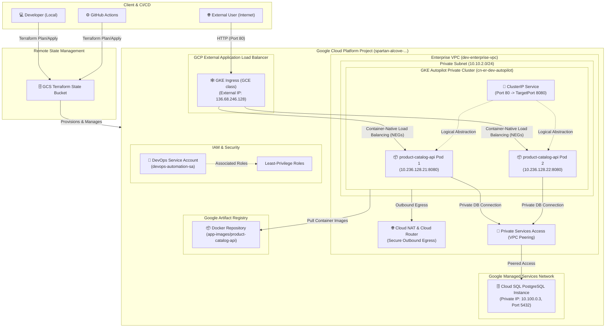

# Cloud Native Enterprise Roadmap (CN-ER)

Production-ready, modular, and cloud-agnostic infrastructure roadmap designed to demonstrate enterprise-grade DevOps and Platform Engineering competencies on Google Cloud Platform (GCP), with multi-cloud adaptability.

---

## 🏗️ Architecture Overview (Phase 2)

Aşağıdaki şema, Phase 2 (Aşama 2) sonunda elde edilen konteynerleştirilmiş uygulama altyapısını, GKE Autopilot private cluster mimarisini, Private Services Access peering entegrasyonunu ve GCP Application Load Balancer (GKE Ingress) ile dış dünyaya güvenli erişim kurgusunu temsil eder.



---

## 🚀 Roadmap & Progress

| Phase | Topic | Status | Technologies |
| :---: | :--- | :---: | :--- |
| **Phase 1** | IaC, VPC, Cloud NAT, IAM & GCS Backend | Completed | Terraform, GCP, Git |
| **Phase 2** | Containerization & GKE Cluster (NEG, Ingress, Cloud SQL) | Completed | Docker, GKE, Kubernetes, PostgreSQL |
| **Phase 3** | GitOps & Continuous Delivery | Planned | ArgoCD, Helm |
| **Phase 4** | Enterprise Observability & Security | Planned | Prometheus, Grafana, Vault |
| **Phase 5** | Multi-Cloud Agnostic Transformation | Planned | Terraform (AWS/GCP abstraction) |

---

## 🛠️ Getting Started & Verification

### 1. Provision Infrastructure (Terraform)
Altyapı modüllerini (Ağ, Artifact Registry, GKE ve Cloud SQL) sırasıyla ayağa kaldırmak için:

```bash
cd environments/dev/terraform
terraform init
terraform plan
terraform apply
```

### 2. Connect to GKE Cluster
Oluşturulan private GKE Autopilot cluster'ına bağlanmak için:
```bash
gcloud container clusters get-credentials cn-er-dev-autopilot --region europe-west3 --project spartan-alcove-450719-n2
```

### 3. Deploy Workloads & Ingress (Kubernetes)
Uygulamayı ve GCP Yük Dengeleyici konfigürasyonunu deploy etmek için:
```bash
kubectl apply -f applications/product-catalog-api/k8s/namespace.yaml
kubectl apply -f applications/product-catalog-api/k8s/configmap.yaml
kubectl apply -f applications/product-catalog-api/k8s/secret.yaml
kubectl apply -f applications/product-catalog-api/k8s/deployment.yaml
kubectl apply -f applications/product-catalog-api/k8s/service.yaml
kubectl apply -f applications/product-catalog-api/k8s/ingress.yaml
```

### 4. Verify External Connectivity
Ingress IP adresini aldıktan sonra (tahsis süresi ~4-6 dakikadır) curl ile endpoint'leri test edin:
```bash
# Ingress durumunu ve IP adresini kontrol edin
kubectl get ingress product-catalog-api-ingress -n cn-er-dev

# API Sağlık durumunu ve veri tabanı bağlantısını kontrol edin
curl -i http://<INGRESS_IP>/health

# Beklenen Yanıt:
# {"status":"healthy","db_connected":true,"version":"0.1.0"}
```

---

## 🗂️ Architecture Decision Records (ADRs)

Detaylı teknik kararlar ve mimari seçimler için [Architecture Decision Records (ADRs)](docs/decision-records/) dizinini inceleyebilirsiniz.

Mevcut ADR dokümanları:
- [ADR 001: Remote GCS Backend and Cloud NAT](docs/decision-records/001-gcs-backend-and-cloud-nat.md)
- [ADR 002: Multi-stage Docker Build](docs/decision-records/002-multi-stage-docker-build.md)
- [ADR 003: GCP Artifact Registry](docs/decision-records/003-artifact-registry.md)
- [ADR 004: GKE Autopilot Cluster](docs/decision-records/004-gke-autopilot.md)
- [ADR 005: Cloud SQL PostgreSQL Integration](docs/decision-records/005-cloud-sql-postgresql.md)
- [ADR 006: Kubernetes Deployment Manifests](docs/decision-records/006-kubernetes-manifests.md)
- [ADR 007: GKE Ingress with GCP Load Balancer](docs/decision-records/007-gke-ingress.md)