# Cloud Native Enterprise Roadmap (CN-ER)

Production-ready, modular, and cloud-agnostic infrastructure roadmap designed to demonstrate enterprise-grade DevOps and Platform Engineering competencies on Google Cloud Platform (GCP), with multi-cloud adaptability.

---

### 🏗️ Architecture Overview (Phase 3)

Aşağıdaki şema, Phase 3 (Aşama 3) sonunda elde edilen GitOps mimarisini, ArgoCD pull-model deployment kurgusunu, Workload Identity entegrasyonlu External Secrets Operator (ESO) ve GCP Secret Manager bağlantısını temsil eder.

```mermaid
graph TD
    subgraph Client ["Client & CI/CD"]
        User["🌐 External User (Internet)"]
        Local["💻 Developer (Local)"]
        GitRepo["🐙 GitHub Repository<br>(Monorepo: cn-er)"]
    end

    subgraph GCP ["Google Cloud Platform Project (spartan-alcove-...)"]
        
        subgraph GLB ["GCP External Application Load Balancer"]
            Ingress["🕸️ GKE Ingress (GCE class)<br>(External IP: 136.68.246.128)"]
        end

        subgraph VPC ["Enterprise VPC (dev-enterprise-vpc)"]
            direction TB
            
            subgraph PrivateSubnet ["Private Subnet (10.10.2.0/24)"]
                subgraph GKE ["GKE Autopilot Private Cluster (cn-er-dev-autopilot)"]
                    direction TB
                    
                    subgraph NS_Argo ["Namespace: argocd"]
                        ArgoCD["⚙️ ArgoCD Controller & Server"]
                    end

                    subgraph NS_ESO ["Namespace: external-secrets"]
                        ESO["🔒 External Secrets Operator"]
                        KSA_ESO["🔑 KSA: external-secrets"]
                    end

                    subgraph NS_Vault ["Namespace: vault"]
                        Vault["🔐 HashiCorp Vault (Raft Storage)"]
                    end

                    subgraph NS_Mon ["Namespace: monitoring"]
                        Prom["📊 Prometheus Server"]
                        Grafana["📈 Grafana Dashboards"]
                    end

                    subgraph NS_App ["Namespace: cn-er-dev"]
                        Pod1["📦 product-catalog-api Pod 1"]
                        Pod2["📦 product-catalog-api Pod 2"]
                        Service["🔌 ClusterIP Service"]
                        ExtSec["🔒 ExternalSecret Resource"]
                        Secret["🔑 K8s Secret (product-catalog-api-secret)"]
                    end
                end
            end

            NAT["🌐 Cloud NAT & Cloud Router<br>(Secure Outbound Egress)"]
            VPC_PEER["🔗 Private Services Access (VPC Peering)"]
        end

        subgraph GAR ["Google Artifact Registry"]
            Registry["📦 Docker Repository<br>(app-images/product-catalog-api)"]
        end

        subgraph SecretManager ["GCP Secret Manager"]
            DBPass["🔑 cn-er-dev-db-password"]
        end

        subgraph ManagedServices ["Google Managed Services Network"]
            CloudSQL["🗄️ Cloud SQL PostgreSQL Instance<br>(Private IP: 10.100.0.3, Port 5432)"]
        end

        subgraph IAM ["IAM & Security"]
            GSA_DevOps["👤 DevOps Service Account<br>(devops-automation-sa)"]
            GSA_ESO["👤 ESO Service Account<br>(eso-secrets-sa)"]
            WI["🔗 GKE Workload Identity"]
        end
    end

    subgraph Backend ["Remote State Management"]
        GCS["🗄️ GCS Terraform State Bucket"]
    end

    User -->|"HTTP (Port 80)"| Ingress
    Ingress -->|"Container-Native Load Balancing (NEGs)"| Pod1
    Ingress -->|"Container-Native Load Balancing (NEGs)"| Pod2
    Service -.->|"Logical Abstraction"| Pod1
    Service -.->|"Logical Abstraction"| Pod2
    
    Pod1 -->|"Private DB Connection"| VPC_PEER
    Pod2 -->|"Private DB Connection"| VPC_PEER
    VPC_PEER -->|"Peered Access"| CloudSQL
    
    ArgoCD -->|"GitOps Pull Manifests"| GitRepo
    ArgoCD -->|"Deploys & Syncs"| NS_App
    
    ExtSec -.->|"Defines"| Secret
    Secret -->|"Provides DB_PASS"| Pod1
    Secret -->|"Provides DB_PASS"| Pod2
    
    KSA_ESO -.->|"Impersonates via WI"| GSA_ESO
    GSA_ESO -->|"Reads Password"| DBPass
    ESO -.->|"Fetches DBPass & Populates"| Secret
    
    KSA_ESO -->|"Kubernetes Auth"| Vault
    ESO -->|"Pulls Secrets"| Vault
    
    Prom -->|"Scrapes Metrics (/metrics)"| Pod1
    Prom -->|"Scrapes Metrics (/metrics)"| Pod2
    Grafana -->|"Queries Metrics"| Prom
    
    GKE -->|"Pull Container Images"| Registry
    GKE -->|"Outbound Egress"| NAT
    
    Local -->|"Terraform Plan/Apply"| GCS
    GCS -->|"Provisions & Manages"| GCP
```



---

## 🚀 Roadmap & Progress

| Phase | Topic | Status | Technologies |
| :---: | :--- | :---: | :--- |
| **Phase 1** | IaC, VPC, Cloud NAT, IAM & GCS Backend | Completed | Terraform, GCP, Git |
| **Phase 2** | Containerization & GKE Cluster (NEG, Ingress, Cloud SQL) | Completed | Docker, GKE, Kubernetes, PostgreSQL |
| **Phase 3** | GitOps & Continuous Delivery | Completed | ArgoCD, Helm, External Secrets Operator, Workload Identity |
| **Phase 4** | Enterprise Observability & Security | Completed | Prometheus, Grafana, Vault |
| **Phase 5** | Multi-Cloud Agnostic Transformation | Planned | Terraform (AWS/GCP abstraction) |

---

## 🛠️ Getting Started & Verification

### 1. Provision Infrastructure & Platform Tools (Terraform)
Altyapı modüllerini ve cluster platform araçlarını (ArgoCD, ESO, IAM) ayağa kaldırmak için:

```bash
# Temel Altyapı (Phase 1 & Phase 2 GAR)
cd environments/dev/terraform
terraform init
terraform apply

# GKE Cluster & Platform Araçları (Phase 2 GKE, ArgoCD, ESO, IAM & Workload Identity)
cd ../gke
terraform init
terraform apply
```

### 2. Connect to GKE Cluster
Oluşturulan private GKE Autopilot cluster'ına bağlanmak için:
```bash
gcloud container clusters get-credentials cn-er-dev-autopilot --region europe-west3 --project spartan-alcove-450719-n2
```

### 3. Deploy Platform GitOps Manifests (Kubernetes)
Secret Store ve GitOps tanımlarını uygulayarak bootstrap sürecini tamamlamak için:
```bash
kubectl apply -f gitops/argo-cd/cluster/cluster-secret-store.yaml
kubectl apply -f gitops/argo-cd/projects/dev-project.yaml
kubectl apply -f gitops/argo-cd/apps/product-catalog-api.yaml
```

### 4. Verify GitOps & Connectivity
GitOps durumunu ve harici erişimi test etmek için:
```bash
# ArgoCD Uygulama durumunu doğrulayın
kubectl get application product-catalog-api -n argocd

# ExternalSecret durumunu kontrol edin (STATUS: SecretSynced olmalıdır)
kubectl get externalsecret product-catalog-api-secret -n cn-er-dev

# Ingress durumunu ve IP adresini kontrol edin
kubectl get ingress product-catalog-api-ingress -n cn-er-dev

# API Sağlık durumunu ve veritabanı bağlantısını kontrol edin
curl -i http://<INGRESS_IP>/health
# Beklenen Yanıt: {"status":"healthy","db_connected":true,"version":"0.1.0"}
```

---

## 🗂️ Architecture Decision Records (ADRs)

Detaylı teknik kararlar ve mimari seçimler için [Architecture Decision Records (ADRs)](docs/decision-records/) dizinini inceleyebilirsiniz.

Mevcut ADR dokümanları:
- [ADR 001: Remote GCS Backend and Cloud NAT](docs/decision-records/001-gcs-backend-and-cloud-nat.md)
- [ADR 002: Multi-stage Docker Build](docs/decision-records/002-multi-stage-docker-build.md)
- [ADR 003: GCP Artifact Registry](docs/decision-records/003-artifact-registry.md)
- [ADR 004: GKE Autopilot Cluster](docs/decision-records/004-gke-autopilot.md)
- [ADR 005: Cloud SQL PostgreSQL Integration](docs/decision-records/005-cloud-sql-private-ip.md)
- [ADR 006: Kubernetes Deployment Manifests](docs/decision-records/006-kubernetes-manifests.md)
- [ADR 007: GKE Ingress with GCP Load Balancer](docs/decision-records/007-gke-ingress.md)
- [ADR 008: GitOps and Secret Management Integration](docs/decision-records/008-gitops-and-secret-management.md)