# Cloud Native Enterprise Roadmap (CN-ER)

Production-ready, modular, and cloud-agnostic infrastructure roadmap designed to demonstrate enterprise-grade DevOps and Platform Engineering competencies on Google Cloud Platform (GCP), with full multi-cloud adaptability via provider-agnostic Terraform modules.

[](https://github.com/edebu/cloud-native-enterprise-roadmap/actions/workflows/ci.yml)
[](https://github.com/edebu/cloud-native-enterprise-roadmap/actions/workflows/cd.yml)
[](https://github.com/edebu/cloud-native-enterprise-roadmap/actions/workflows/tf-plan.yml)

---

### 🏗️ Architecture Overview (Phase 5)

Aşağıdaki şema, Phase 5 (Aşama 5) sonunda elde edilen cloud-agnostic mimariyi, provider-agnostic Terraform modül hiyerarşisini ve GitHub Actions CI/CD pipeline'ını temsil eder.

```mermaid
graph TD
    subgraph CICD ["GitHub Actions CI/CD"]
        PR["🔀 Pull Request<br>(ci.yml: test + trivy + tf-validate)"]
        Merge["✅ Merge to main<br>(cd.yml: build + push + sync)"]
        TFPlan["📋 TF Plan Comment<br>(tf-plan.yml)"]
    end

    subgraph Modules ["Cloud-Agnostic Terraform Modules"]
        direction LR
        MNet["modules/network<br>gcp/ + aws/"]
        MK8s["modules/kubernetes<br>gcp/ + aws/"]
        MDB["modules/database<br>gcp/ + aws/"]
        MReg["modules/registry<br>gcp/ + aws/"]
        MIAM["modules/iam<br>gcp/ + aws/"]
        MSec["modules/secrets<br>gcp/ + aws/"]
    end

    subgraph GCP ["Google Cloud Platform (Active — Phases 1-5)"]
        subgraph GCPNET ["GCP Network"]
            VPC["🕸️ VPC (dev-enterprise-vpc)<br>Cloud NAT + Cloud Router"]
        end
        subgraph GCPK8S ["GKE Autopilot"]
            ArgoCD["⚙️ ArgoCD"]
            ESO["🔒 ESO + Workload Identity"]
            Vault["🔐 HashiCorp Vault"]
            Prom["📊 Prometheus + Grafana"]
            App["📦 product-catalog-api"]
        end
        CloudSQL["🗄️ Cloud SQL PostgreSQL 16"]
        GAR["📦 Google Artifact Registry"]
        SecMgr["🔑 GCP Secret Manager"]
    end

    subgraph AWS ["Amazon Web Services (Code + Plan — Phase 5)"]
        subgraph AWSNET ["AWS Network"]
            AWSVPC["🕸️ VPC (10.20.0.0/16)<br>NAT Gateway + IGW"]
        end
        subgraph AWSK8S ["EKS Managed Node Group"]
            IRSA["🔗 IRSA (OIDC)"]
        end
        RDS["🗄️ RDS PostgreSQL 15"]
        ECR["📦 ECR"]
        AWSSecMgr["🔑 AWS Secrets Manager"]
    end

    PR --> Merge
    Merge -->|"docker push"| GAR
    Merge -->|"argocd app sync"| ArgoCD
    TFPlan -->|"posted as PR comment"| PR

    MNet -->|"cloud_provider=gcp"| VPC
    MNet -->|"cloud_provider=aws"| AWSVPC
    MK8s -->|"cloud_provider=gcp"| GCPK8S
    MK8s -->|"cloud_provider=aws"| AWSK8S
    MDB -->|"cloud_provider=gcp"| CloudSQL
    MDB -->|"cloud_provider=aws"| RDS
    MReg -->|"cloud_provider=gcp"| GAR
    MReg -->|"cloud_provider=aws"| ECR
    MSec -->|"cloud_provider=gcp"| SecMgr
    MSec -->|"cloud_provider=aws"| AWSSecMgr
```



---

## 🚀 Roadmap & Progress

| Phase | Topic | Status | Technologies |
| :---: | :--- | :---: | :--- |
| **Phase 1** | IaC, VPC, Cloud NAT, IAM & GCS Backend | ✅ Completed | Terraform, GCP, Git |
| **Phase 2** | Containerization & GKE Cluster (NEG, Ingress, Cloud SQL) | ✅ Completed | Docker, GKE, Kubernetes, PostgreSQL |
| **Phase 3** | GitOps & Continuous Delivery | ✅ Completed | ArgoCD, Helm, External Secrets Operator, Workload Identity |
| **Phase 4** | Enterprise Observability & Security | ✅ Completed | Prometheus, Grafana, Vault |
| **Phase 5** | Multi-Cloud Agnostic Transformation | ✅ Completed | Terraform (AWS/GCP abstraction), GitHub Actions |

---

## 🏛️ Multi-Cloud Module Architecture

Phase 5'in temel katkısı, tüm Terraform modüllerinin cloud-agnostic wrapper pattern'e dönüştürülmesidir:

```
modules/
├── network/          ← Wrapper: var.cloud_provider = "gcp" | "aws"
│   ├── gcp/          ← VPC, Cloud NAT, Cloud Router, Firewall Rules
│   └── aws/          ← VPC, IGW, NAT Gateway, Security Groups
├── kubernetes/
│   ├── gcp/          ← GKE Autopilot
│   └── aws/          ← EKS Managed Node Group + IRSA (OIDC)
├── database/
│   ├── gcp/          ← Cloud SQL PostgreSQL (Private Service Access)
│   └── aws/          ← RDS PostgreSQL (DB Subnet Group)
├── registry/
│   ├── gcp/          ← Google Artifact Registry (DOCKER)
│   └── aws/          ← ECR + Lifecycle Policy
├── iam/
│   ├── gcp/          ← Service Account + Project IAM Bindings
│   └── aws/          ← IAM Role + Instance Profile + Policy Attachments
└── secrets/
    ├── gcp/          ← GCP Secret Manager
    └── aws/          ← AWS Secrets Manager + IRSA Read Policy
```

### GCP ↔ AWS Equivalence Map

| Component | GCP | AWS |
|:----------|:----|:----|
| Virtual Network | VPC (`google_compute_network`) | VPC (`aws_vpc`) |
| Egress NAT | Cloud NAT + Cloud Router | NAT Gateway + Elastic IP |
| Kubernetes | GKE Autopilot | EKS Managed Node Group |
| Pod Cloud Identity | Workload Identity (KSA→GSA) | IRSA (OIDC token exchange) |
| Database | Cloud SQL PostgreSQL 16 | RDS PostgreSQL 15 |
| Container Registry | Artifact Registry (GAR) | Elastic Container Registry (ECR) |
| Secret Store | Secret Manager | AWS Secrets Manager |
| CI/CD Auth | Workload Identity Federation | WIF (same — GitHub OIDC) |

---

## 🛠️ Getting Started & Verification

### 1. Provision Infrastructure (GCP — Active Environment)

```bash
# Base Infrastructure (Phase 1 & Phase 2 GAR)
cd environments/dev/terraform
terraform init
terraform apply -var="project_id=<YOUR_PROJECT_ID>"

# GKE Cluster & Platform Tools (Phase 2 GKE, ArgoCD, ESO, IAM & Workload Identity)
cd gke
terraform init
terraform apply -var="project_id=<YOUR_PROJECT_ID>"
```

### 2. Connect to GKE Cluster

```bash
gcloud container clusters get-credentials cn-er-dev-autopilot \
  --region europe-west3 \
  --project <YOUR_PROJECT_ID>
```

### 3. Deploy Platform GitOps Manifests (Kubernetes)

```bash
kubectl apply -f gitops/argo-cd/cluster/cluster-secret-store.yaml
kubectl apply -f gitops/argo-cd/projects/dev-project.yaml
kubectl apply -f gitops/argo-cd/apps/product-catalog-api.yaml
```

### 4. Verify GitOps & Connectivity

```bash
# ArgoCD Application status
kubectl get application product-catalog-api -n argocd

# ExternalSecret status (STATUS: SecretSynced beklenmeli)
kubectl get externalsecret product-catalog-api-secret -n cn-er-dev

# Ingress IP
kubectl get ingress product-catalog-api-ingress -n cn-er-dev

# API health check
curl -i http://<INGRESS_IP>/health
# Expected: {"status":"healthy","db_connected":true,"version":"0.1.0"}
```

### 5. Switch to AWS (Multi-Cloud Demo)

AWS modüllerini çalıştırmak için:

```bash
# AWS credentials yapılandır
export AWS_ACCESS_KEY_ID=...
export AWS_SECRET_ACCESS_KEY=...
export AWS_DEFAULT_REGION=eu-central-1

# AWS provider'ı etkinleştir (örnek providers.tf gerektirir)
# Tüm modüller cloud_provider = "aws" ile çağrılabilir:
# module "network" {
#   source         = "../../../modules/network"
#   cloud_provider = "aws"
#   region         = "eu-central-1"
#   ...
# }
```

Detaylı kullanım kılavuzu: [docs/multi-cloud-usage-guide.md](docs/multi-cloud-usage-guide.md)

---

## 🔄 CI/CD Pipeline

Phase 5 ile eklenen GitHub Actions pipeline'ı:

| Workflow | Tetikleyici | Adımlar |
|:---------|:-----------|:--------|
| `ci.yml` | Her PR | pytest → Docker build → Trivy scan → TF validate |
| `cd.yml` | main'e merge | WIF auth → GAR push → ArgoCD sync |
| `tf-plan.yml` | Terraform PR | TF plan → PR comment |

**Keyless GCP Authentication:** GitHub Actions, service account JSON key gerektirmeden GCP Workload Identity Federation (WIF) üzerinden authenticate olur.

Kurulum için gerekli GitHub Secrets:
- `GCP_PROJECT_ID`
- `GCP_WIF_PROVIDER`
- `GCP_WIF_SERVICE_ACCOUNT`

---

## 🗂️ Architecture Decision Records (ADRs)

Detaylı teknik kararlar için [docs/decision-records/](docs/decision-records/) dizinini inceleyin.

| ADR | Konu | Faz |
|:-----|:-----|:-----|
| [ADR 001](docs/decision-records/001-gcs-backend-and-cloud-nat.md) | Remote GCS Backend and Cloud NAT | Phase 1 |
| [ADR 002](docs/decision-records/002-multi-stage-docker-build.md) | Multi-stage Docker Build | Phase 2 |
| [ADR 003](docs/decision-records/003-artifact-registry.md) | GCP Artifact Registry | Phase 2 |
| [ADR 004](docs/decision-records/004-gke-autopilot.md) | GKE Autopilot Cluster | Phase 2 |
| [ADR 005](docs/decision-records/005-cloud-sql-private-ip.md) | Cloud SQL PostgreSQL Integration | Phase 2 |
| [ADR 006](docs/decision-records/006-kubernetes-manifests.md) | Kubernetes Deployment Manifests | Phase 2 |
| [ADR 007](docs/decision-records/007-gke-ingress.md) | GKE Ingress with GCP Load Balancer | Phase 2 |
| [ADR 008](docs/decision-records/008-gitops-and-secret-management.md) | GitOps and Secret Management Integration | Phase 3 |
| [ADR 009](docs/decision-records/009-multi-cloud-strategy.md) | **Multi-Cloud Agnostic Terraform Module Strategy** | Phase 5 |
| [ADR 010](docs/decision-records/010-aws-network-design.md) | **AWS Network Design** | Phase 5 |
| [ADR 011](docs/decision-records/011-eks-vs-gke-tradeoffs.md) | **EKS vs GKE Autopilot Tradeoffs** | Phase 5 |
| [ADR 012](docs/decision-records/012-rds-vs-cloud-sql.md) | **RDS vs Cloud SQL** | Phase 5 |
| [ADR 013](docs/decision-records/013-github-actions-cicd.md) | **GitHub Actions CI/CD Pipeline Design** | Phase 5 |
| [ADR 014](docs/decision-records/014-aws-iam-vs-gcp-iam.md) | **AWS IAM vs GCP IAM** | Phase 5 |