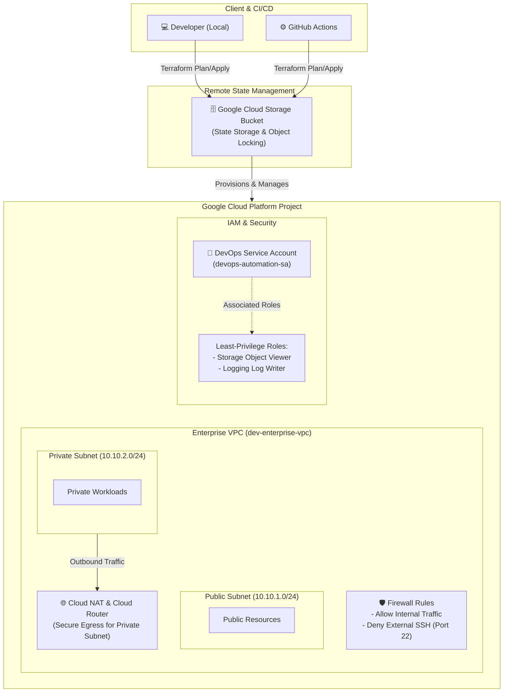

# Cloud Native Enterprise Roadmap (CN-ER)

Production-ready, modular, and cloud-agnostic infrastructure roadmap designed to demonstrate enterprise-grade DevOps and Platform Engineering competencies on Google Cloud Platform (GCP), with multi-cloud adaptability.

---

## 🏗️ Architecture Overview (Phase 1)

Aşağıdaki şema, Aşama 1 kapsamında kurulan güvenli kurumsal ağ topolojisini, GCS remote backend yapısını ve least-privilege IAM sınırlarını temsil eder.



---

## 🚀 Roadmap & Progress

| Phase | Topic | Status | Technologies |
| :---: | :--- | :---: | :--- |
| **Phase 1** | IaC, VPC, Cloud NAT, IAM & GCS Backend | Completed | Terraform, GCP, Git |
| **Phase 2** | Containerization & GKE Cluster | In Progress | Docker, GKE, Kubernetes |
| **Phase 3** | GitOps & Continuous Delivery | Planned | ArgoCD, Helm |
| **Phase 4** | Enterprise Observability & Security | Planned | Prometheus, Grafana, Vault |
| **Phase 5** | Multi-Cloud Agnostic Transformation | Planned | Terraform (AWS/GCP abstraction) |

---

## 🛠️ Getting Started (Phase 1)

1. **Clone the Repository:**
   ```bash
   git clone https://github.com/edebu/cloud-native-enterprise-roadmap.git
   cd cloud-native-enterprise-roadmap/environments/dev/terraform
   ```

2. **Initialize Terraform with GCS Backend:**

    ```bash
    terraform init
    ```

3. **Apply Infrastructure:**

    ```bash
    terraform plan
    terraform apply
    ```

## 🗂️ Architecture Decision Records (ADRs)

For detailed technical decisions and architectural choices, please refer to the [Architecture Decision Records (ADRs)](docs/decision-records/) directory.

Key ADRs include:
- [ADR 001: Remote GCS Backend and Cloud NAT](docs/decision-records/001-gcs-backend-and-cloud-nat.md)

---

### Adım 4: Commit ve PR İşlemleri

Tüm bu dokümantasyon dosyaları hazır olduğunda, repoyu commit'leyip PR aşamasına geçebiliriz:

```bash
# Değişiklikleri ekle
git add .

# Commit et
git commit -m "docs: add enterprise-grade README, architecture summary, and ADR 001"

# GitHub'a gönder
git push -u origin feature/phase1-documentation-and-adr